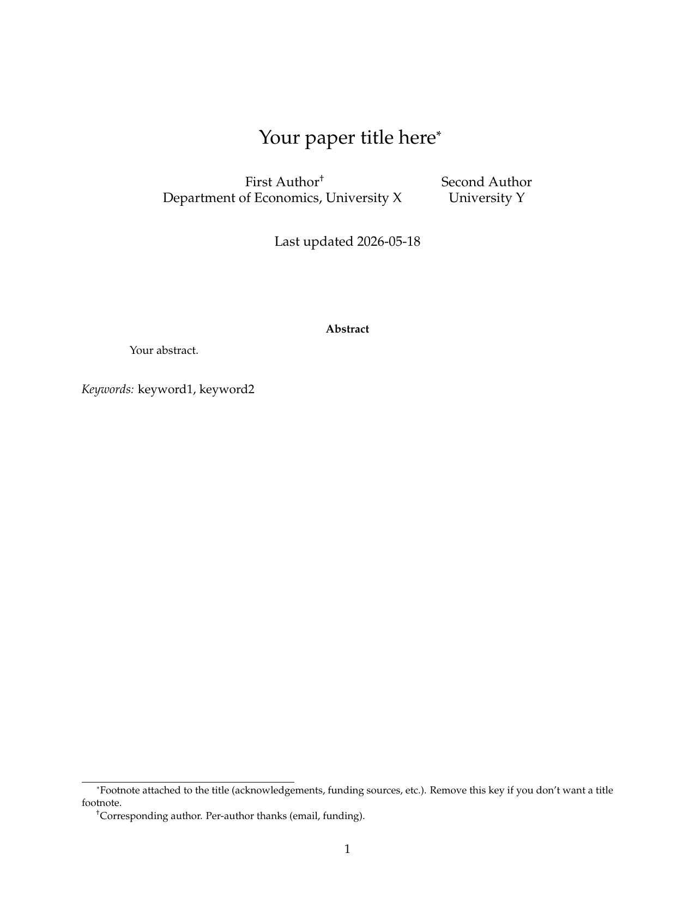
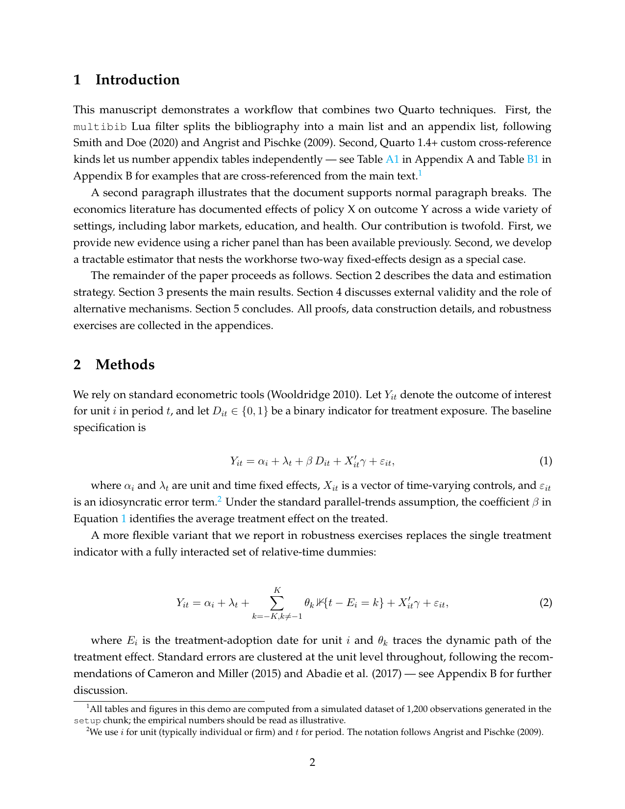
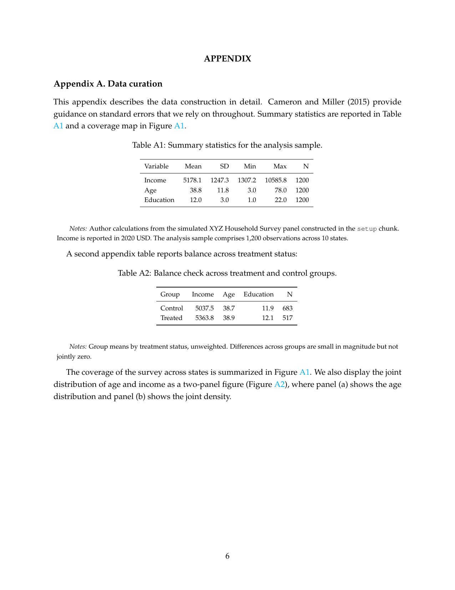
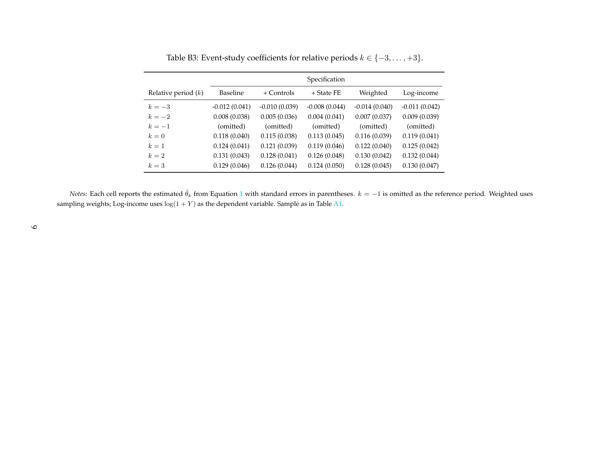

# econ-paper

A Quarto extension I built to make writing my own health-economics
and public-health manuscripts in Quarto less of a fight with the
defaults. It's not trying to be a polished journal template — it
just bundles the bits I kept reinventing every time I started a new
paper.

If you write applied-econ or empirical-health papers in Quarto and
the standard `format: pdf` setup isn't quite serving you, this might
save you a weekend.

## What's in it

- **Separate bibliographies** for the main text and the appendix
  (via Albert Krewinkel's `multibib` Lua filter, vendored). Each
  references section pulls from its own `.bib` file and renders as
  its own list.
- **Independently numbered appendix tables and figures**: Table A1,
  A2, B1, B2; Figure A1, B1. Cross-referenceable from the main text
  with `@apxatbl-foo`.
- **AEA-style title block** by default (adapted from
  hchulkim/econ-paper-template), with a numeric-superscript variant
  if you want the more biomedical-looking author block.
- **Lancet citation style** as a bundled variant — useful when a
  health-econ paper is going to a medical journal.
- **Journal-style notes** under tables and figures
  (`::: {.tblnotes}` → small italic indented block, *Notes:* on
  conventional formatting).
- **Landscape wide tables** (`::: {.landscape}`) for the regression
  tables that don't fit portrait.
- A handful of LaTeX paper-cuts smoothed over: tighter caption-to-
  table spacing in the appendix, breathing room above figure
  captions, compact bibliography line-spacing, forced `[H]`
  placement on appendix floats so a Notes block can't print before
  its table.

## Preview

A few pages from a render of `template.qmd` (the latest full PDF
ships as an asset on every [release](https://github.com/fikrurizal/quarto-econ-paper/releases)):

| Title block (AEA-style)             | Methods, with display math               |
| ----------------------------------- | ---------------------------------------- |
|  |  |

| Appendix tables with notes              | Landscape wide event-study table         |
| --------------------------------------- | ---------------------------------------- |
|  |  |

## Install

```bash
quarto install extension fikrurizal/quarto-econ-paper
```

or, to start a new project from the included templates:

```bash
quarto use template fikrurizal/quarto-econ-paper
```

## Render

```bash
quarto render template.qmd          # AEA-style title block (default)
quarto render template-numeric.qmd  # numeric superscript affiliations
quarto render template-lancet.qmd   # Lancet citation style
```

All three render to both PDF and HTML.

## Writing a paper with it

Your `.qmd` YAML wants something like this — the minimum is shown
in [template.qmd](template.qmd):

```yaml
title: "..."
author:
  - name: First Author
    affiliations:
      - name: Australian National University
        department: Research School of Population Health
abstract: |
  ...

# Topic-name → bib file map. The extension's inject-bib.lua filter
# rewrites this into pandoc's `bibliography:` slot — Quarto's YAML
# schema otherwise refuses to accept a map there.
multibib-bibliography:
  main: refs-main.bib
  appendix: refs-appendix.bib

format:
  econ-paper-pdf:
    keep-tex: true
  econ-paper-html: default
```

In your sections, drop a placeholder div wherever each bib should
appear (the div id must match the YAML key):

```markdown
# References {.unnumbered}

::: {#refs-main}
:::
```

```markdown
# Appendix References {.unnumbered}

::: {#refs-appendix}
:::
```

For an appendix table that should number as "Table A1":

```markdown
::: {#apxatbl-summary}

| Variable | Mean | SD |
|----------|-----:|---:|
| Income   | 4250 | 1100 |

Summary statistics for the analysis sample.

:::

::: {.tblnotes}
*Notes:* Author calculations from the XYZ Survey, 2018–2020.
Income reported in 2020 USD.
:::
```

Reference it from prose with `@apxatbl-summary` (renders as
"Table A1"). Other prefixes: `apxbtbl-` for Appendix B tables,
`apxafig-`/`apxbfig-` for figures.

For the appendix divider that prints "APPENDIX" centered in caps:

```markdown
# Appendix {.supplementary}

## Appendix A. Data curation {.unnumbered}
...
```

## Variants

Three template files at the repo root show the three combos
I actually use. Pick one and delete the rest:

| File                    | Title block              | Citation style                                  |
| ----------------------- | ------------------------ | ----------------------------------------------- |
| `template.qmd`          | AEA stack (default)      | Author-year (CSL default)                       |
| `template-numeric.qmd`  | Numeric superscript      | Author-year                                     |
| `template-lancet.qmd`   | AEA stack                | Lancet numeric superscript, sorted by appearance |

You can switch any time by editing your document YAML — set
`csl: ...` for a different citation style, or
`template-partials: [...]` for a different title block. See the
variant files for examples.

## Adopting into an existing project

If you already have a Quarto manuscript and want to migrate:

1. `quarto install extension fikrurizal/quarto-econ-paper`
2. Add `format: econ-paper-pdf:` and `multibib-bibliography:` to your
   document YAML (copy from [template.qmd](template.qmd)).
3. Split your `.bib` into main and appendix files.
4. Replace your existing `# References` section with the placeholder
   div pattern shown above; add an `# Appendix References` section
   at the end of the appendix.
5. Mark appendix tables and figures with `::: {#apxatbl-foo}` etc.
6. Render and audit the PDF.

If you're a Claude Code user, there's a skill at
`~/.claude/skills/quarto-econ-paper/SKILL.md` that walks Claude
through the adoption checklist — it tends to catch the common
mistakes (mismatched topic names, missing placeholder divs).

## What's wired inside

| File                                                         | What it does                                          |
| ------------------------------------------------------------ | ----------------------------------------------------- |
| `_extensions/fikrurizal/econ-paper/_extension.yml`           | Format definition, crossref kinds, filter list        |
| `filters/inject-bib.lua`                                     | `multibib-bibliography:` YAML → `bibliography:` map   |
| `filters/div-to-env.lua`                                     | `.tblnotes` / `.landscape` divs → LaTeX envs          |
| `filters/supplementary.lua`                                  | `# Foo {.supplementary}` → centered uppercase divider |
| `filters/multibib.lua`                                       | Vendored pandoc-ext/multibib                          |
| `partials/before-body.tex`                                   | AEA-style title block (default)                       |
| `partials/before-body-numeric.tex`                           | Numeric superscript title block                       |
| `partials/_include-in-header.tex`                            | LaTeX packages, caption/bib spacing, float placement  |
| `csl/the-lancet.csl`                                         | Lancet CSL                                            |

## Known quirks

- `multibib-bibliography:` is a non-standard YAML key. Without this
  extension installed, Quarto silently ignores it and you get empty
  bibliographies. Always confirm the extension is in `_extensions/`
  before rendering.
- Forced `[H]` placement on appendix floats sometimes leaves
  whitespace LaTeX would have preferred to fill. The trade-off is
  that a Notes block can't drift past its table.
- Lancet style suppresses author names, which can read awkwardly
  ("following¹ and²"). Reword to "following prior work¹,²" when it
  matters.

## Credits

- AEA-style title block adapted from
  [hchulkim/econ-paper-template](https://github.com/hchulkim/econ-paper-template)
  (MIT).
- `multibib.lua` from
  [pandoc-ext/multibib](https://github.com/pandoc-ext/multibib)
  (Albert Krewinkel, ISC).
- `the-lancet.csl` from
  [citation-style-language/styles](https://github.com/citation-style-language/styles)
  (CC BY-SA 3.0; the rest of this repo is MIT).

## License

MIT for the original code in this repo. Vendored files keep their
upstream licenses (see Credits above).
